# README
* Author: Michael De Santis
* CUID: 101213450
* Date: 2025/04/29

## Description
Sample results from an execution of the `run_all_examples.sh` script. Each experimental subdirectory contains the following files:
* JSON Configuration file used to configure and visualize the experiment
* CSV grid log output of the experimental simulation
* A diagram showing the experimental configuration and cell coordinates
* Simulation visualization images for:
    * Initial state (`t=0`)
    * Final state (`t=95`)
* A `.webm` video of the entire simulation
* A `.gif` video of the entire simulation

## Experiments
Experiments in this directory are organized as follows:

### Example 1: High Occupany 
* Occupancy: 44/48 workstations occupied
* Configuration 1: Scattered occupancy pattern
    * Variation 1: Occupancy sensors disabled
    * Variation 2: Occupancy sensors enabled
* Configuration 2: Condensed occupancy pattern 
    * Variation 1: Occupancy sensors disabled
    * Variation 2: Occupancy sensors enabled
    
### Example 2: Half Occupany 
* Occupancy: 24/48 workstations occupied
* Configuration 1: Scattered occupancy pattern
    * Variation 1: Occupancy sensors disabled
    * Variation 2: Occupancy sensors enabled
* Configuration 2: Condensed occupancy pattern 
    * Variation 1: Occupancy sensors disabled
    * Variation 2: Occupancy sensors enabled
    
### Example 3: Low Occupany 
* Occupancy: 8/48 workstations occupied
* Configuration 1: Scattered occupancy pattern
    * Variation 1: Occupancy sensors disabled
    * Variation 2: Occupancy sensors enabled
* Configuration 2: Condensed occupancy pattern 
    * Variation 1: Occupancy sensors disabled
    * Variation 2: Occupancy sensors enabled

## Experiment Simulation Visualizations
The section below presents a summary of simulation visualizations for each experiment listed above. For complete experimental files, please see the dedicated subdirectories.

### Example 1: High Occupancy (44/48)

#### Configuration 1: Scattered Occupancy Pattern
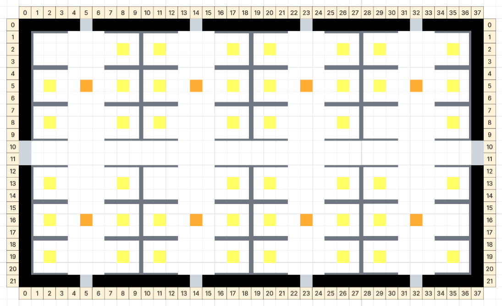

##### Variation 1: Occupancy Sensors Disabled
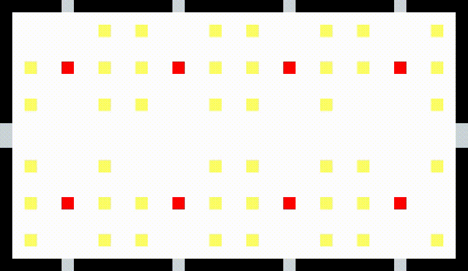

##### Variation 2: Occupancy Sensors Enabled


___

#### Configuration 2: Consolidated Occupancy Pattern
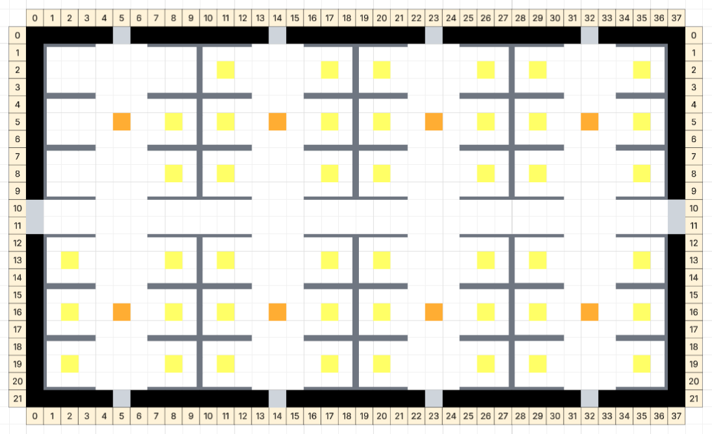

##### Variation 1: Occupancy Sensors Disabled
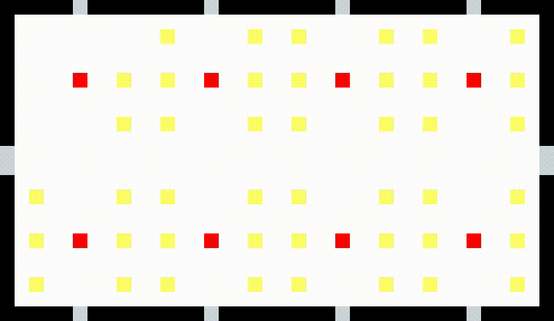

##### Variation 2: Occupancy Sensors Enabled


---

### Example 2: Half Occupancy (24/48)

#### Configuration 1: Scattered Occupancy Pattern
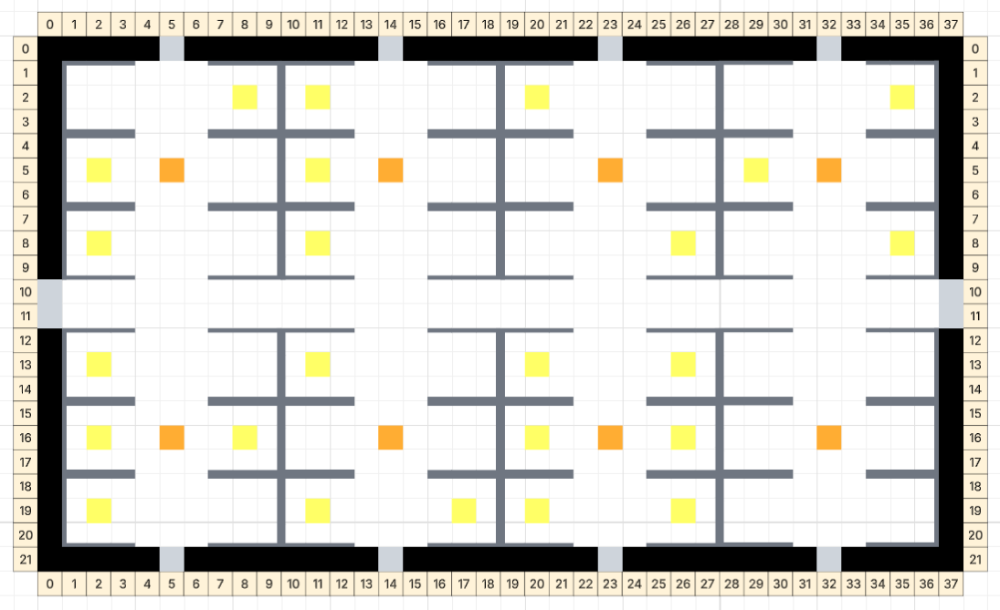

##### Variation 1: Occupancy Sensors Disabled
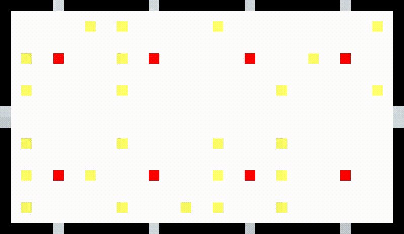

##### Variation 2: Occupancy Sensors Enabled


___

#### Configuration 2: Consolidated Occupancy Pattern
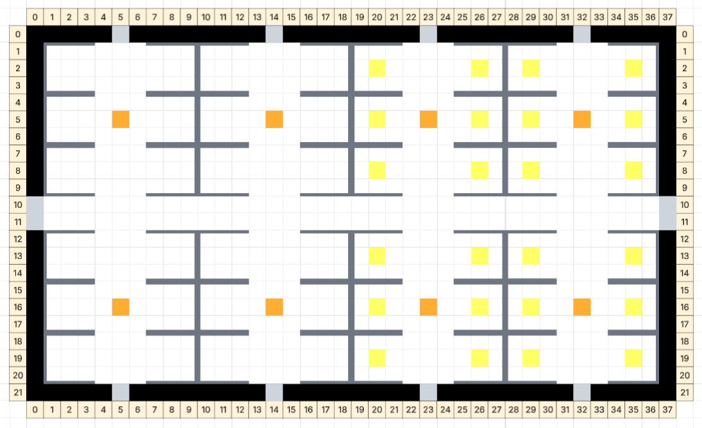

##### Variation 1: Occupancy Sensors Disabled
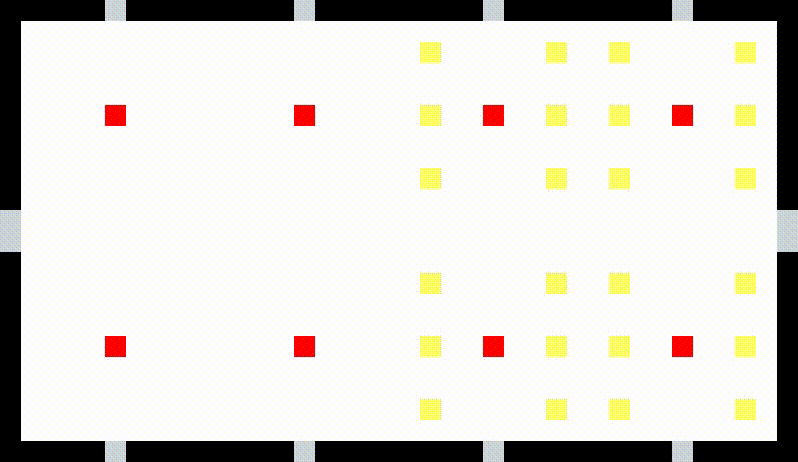

##### Variation 2: Occupancy Sensors Enabled
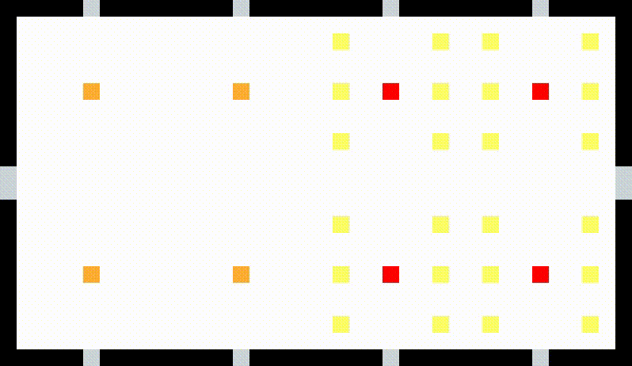

---

### Example 3: Low Occupancy (8/48)

#### Configuration 1: Scattered Occupancy Pattern
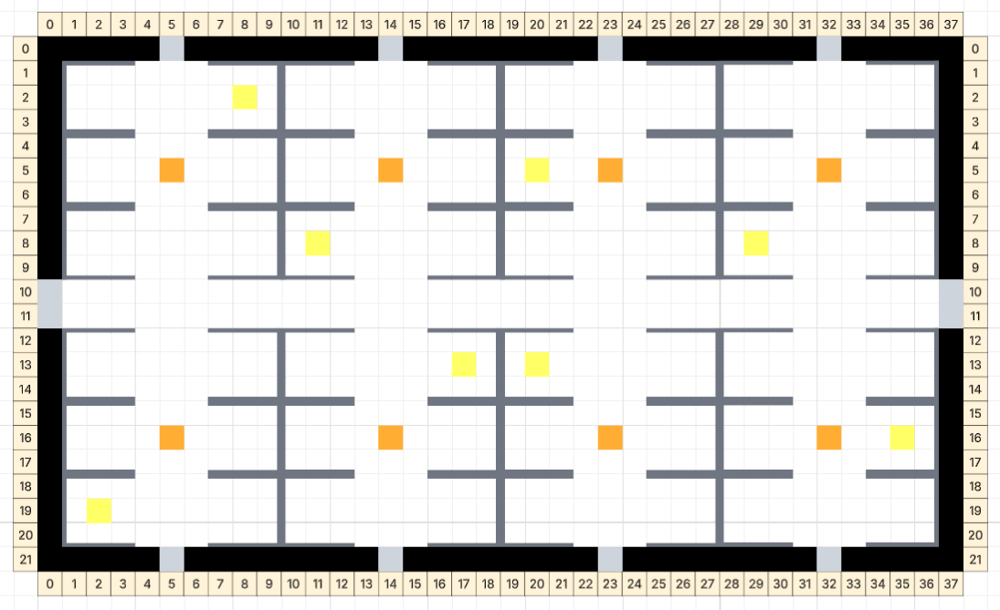

##### Variation 1: Occupancy Sensors Disabled


##### Variation 2: Occupancy Sensors Enabled


___

#### Configuration 2: Consolidated Occupancy Pattern
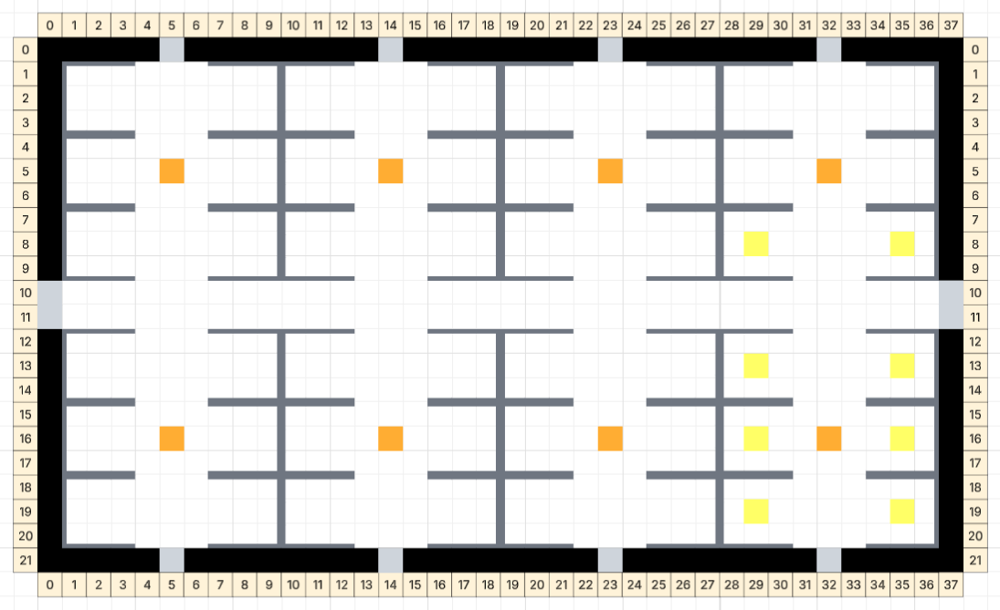

##### Variation 1: Occupancy Sensors Disabled
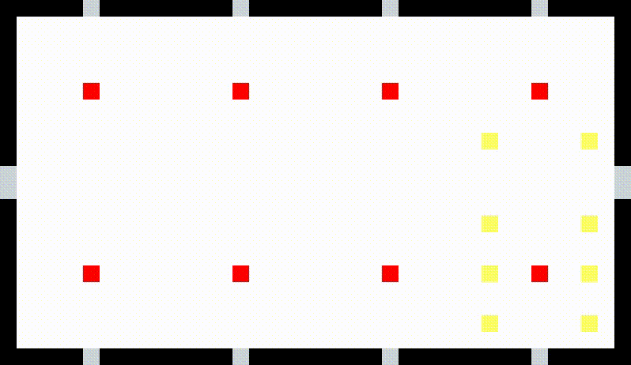

##### Variation 2: Occupancy Sensors Enabled


## File Organization
Files associated with the above example experiments are organized in this directory as follows:
```sh
.
├── ex01
│   ├── c01
│   │   ├── ex01_c01_floorplan.png
│   │   ├── v01
│   │   │   ├── ex01_c01_v01_bimsim_config.json
│   │   │   ├── ex01_c01_v01_bimsim_grid_log.csv
│   │   │   ├── ex01_c01_v01_bimsim_t_0.png
│   │   │   ├── ex01_c01_v01_bimsim_t_95.png
│   │   │   ├── ex01_c01_v01_bimsim_video.gif
│   │   │   └── ex01_c01_v01_bimsim_video.webm
│   │   └── v02
│   │       ├── ex01_c01_v02_bimsim_config.json
│   │       ├── ex01_c01_v02_bimsim_grid_log.csv
│   │       ├── ex01_c01_v02_bimsim_t_0.png
│   │       ├── ex01_c01_v02_bimsim_t_95.png
│   │       ├── ex01_c01_v02_bimsim_video.gif
│   │       └── ex01_c01_v02_bimsim_video.webm
│   └── c02
│       ├── ex01_c02_floorplan.png
│       ├── v01
│       │   ├── ex01_c02_v01_bimsim_config.json
│       │   ├── ex01_c02_v01_bimsim_grid_log.csv
│       │   ├── ex01_c02_v01_bimsim_t_0.png
│       │   ├── ex01_c02_v01_bimsim_t_95.png
│       │   ├── ex01_c02_v01_bimsim_video.gif
│       │   └── ex01_c02_v01_bimsim_video.webm
│       └── v02
│           ├── ex01_c02_v02_bimsim_config.json
│           ├── ex01_c02_v02_bimsim_grid_log.csv
│           ├── ex01_c02_v02_bimsim_t_0.png
│           ├── ex01_c02_v02_bimsim_t_95.png
│           ├── ex01_c02_v02_bimsim_video.gif
│           └── ex01_c02_v02_bimsim_video.webm
├── ex02
│   ├── c01
│   │   ├── ex02_c01_floorplan.png
│   │   ├── v01
│   │   │   ├── ex02_c01_v01_bimsim_config.json
│   │   │   ├── ex02_c01_v01_bimsim_grid_log.csv
│   │   │   ├── ex02_c01_v01_bimsim_t_0.png
│   │   │   ├── ex02_c01_v01_bimsim_t_95.png
│   │   │   ├── ex02_c01_v01_bimsim_video.gif
│   │   │   └── ex02_c01_v01_bimsim_video.webm
│   │   └── v02
│   │       ├── ex02_c01_v02_bimsim_config.json
│   │       ├── ex02_c01_v02_bimsim_grid_log.csv
│   │       ├── ex02_c01_v02_bimsim_t_0.png
│   │       ├── ex02_c01_v02_bimsim_t_95.png
│   │       ├── ex02_c01_v02_bimsim_video.gif
│   │       └── ex02_c01_v02_bimsim_video.webm
│   └── c02
│       ├── ex02_c02_floorplan.png
│       ├── v01
│       │   ├── ex02_c02_v01_bimsim_config.json
│       │   ├── ex02_c02_v01_bimsim_grid_log.csv
│       │   ├── ex02_c02_v01_bimsim_t_0.png
│       │   ├── ex02_c02_v01_bimsim_t_95.png
│       │   ├── ex02_c02_v01_bimsim_video.gif
│       │   └── ex02_c02_v01_bimsim_video.webm
│       └── v02
│           ├── ex02_c02_v02_bimsim_config.json
│           ├── ex02_c02_v02_bimsim_grid_log.csv
│           ├── ex02_c02_v02_bimsim_t_0.png
│           ├── ex02_c02_v02_bimsim_t_95.png
│           ├── ex02_c02_v02_bimsim_video.gif
│           └── ex02_c02_v02_bimsim_video.webm
├── ex03
│   ├── c01
│   │   ├── ex03_c01_floorplan.png
│   │   ├── v01
│   │   │   ├── ex03_c01_v01_bimsim_config.json
│   │   │   ├── ex03_c01_v01_bimsim_grid_log.csv
│   │   │   ├── ex03_c01_v01_bimsim_t_0.png
│   │   │   ├── ex03_c01_v01_bimsim_t_95.png
│   │   │   ├── ex03_c01_v01_bimsim_video.gif
│   │   │   └── ex03_c01_v01_bimsim_video.webm
│   │   └── v02
│   │       ├── ex03_c01_v02_bimsim_config.json
│   │       ├── ex03_c01_v02_bimsim_grid_log.csv
│   │       ├── ex03_c01_v02_bimsim_t_0.png
│   │       ├── ex03_c01_v02_bimsim_t_95.png
│   │       ├── ex03_c01_v02_bimsim_video.gif
│   │       └── ex03_c01_v02_bimsim_video.webm
│   └── c02
│       ├── ex03_c02_floorplan.png
│       ├── v01
│       │   ├── ex03_c02_v01_bimsim_config.json
│       │   ├── ex03_c02_v01_bimsim_grid_log.csv
│       │   ├── ex03_c02_v01_bimsim_t_0.png
│       │   ├── ex03_c02_v01_bimsim_t_95.png
│       │   ├── ex03_c02_v01_bimsim_video.gif
│       │   └── ex03_c02_v01_bimsim_video.webm
│       └── v02
│           ├── ex03_c02_v02_bimsim_config.json
│           ├── ex03_c02_v02_bimsim_grid_log.csv
│           ├── ex03_c02_v02_bimsim_t_0.png
│           ├── ex03_c02_v02_bimsim_t_95.png
│           ├── ex03_c02_v02_bimsim_video.gif
│           └── ex03_c02_v02_bimsim_video.webm
└── experimental-frame
    ├── cell_legend.png
    ├── floorplan.png
    └── moore_neighbourhood_r4.png
```

## Script Output
Output of the `run_all_examples.sh` script for this execution was as follows:
```sh
$ ./run_all_examples.sh
EXECUTING /home/mdesantis/school/sysc/4906g/bimsim/run_all_examples.sh...


Executing all simulation examples...


********************************************************************
Executing all simulations for Example 01: High Occupancy Work Day...

Executing simulation with the following parameters:
	* Config File: /home/mdesantis/school/sysc/4906g/bimsim/examples/ex01/c01/v01/ex01_c01_v01_bimsim_config.json
	* Simulation Duration: 96
	* Output File: /home/mdesantis/school/sysc/4906g/bimsim/examples/ex01/c01/v01/ex01_c01_v01_bimsim_grid_log.csv
Simulation complete.

Executing simulation with the following parameters:
	* Config File: /home/mdesantis/school/sysc/4906g/bimsim/examples/ex01/c01/v02/ex01_c01_v02_bimsim_config.json
	* Simulation Duration: 96
	* Output File: /home/mdesantis/school/sysc/4906g/bimsim/examples/ex01/c01/v02/ex01_c01_v02_bimsim_grid_log.csv
Simulation complete.

Executing simulation with the following parameters:
	* Config File: /home/mdesantis/school/sysc/4906g/bimsim/examples/ex01/c02/v01/ex01_c02_v01_bimsim_config.json
	* Simulation Duration: 96
	* Output File: /home/mdesantis/school/sysc/4906g/bimsim/examples/ex01/c02/v01/ex01_c02_v01_bimsim_grid_log.csv
Simulation complete.

Executing simulation with the following parameters:
	* Config File: /home/mdesantis/school/sysc/4906g/bimsim/examples/ex01/c02/v02/ex01_c02_v02_bimsim_config.json
	* Simulation Duration: 96
	* Output File: /home/mdesantis/school/sysc/4906g/bimsim/examples/ex01/c02/v02/ex01_c02_v02_bimsim_grid_log.csv
Simulation complete.

********************************************************************
Executing all simulations for Example 02: Half Occupancy Work Day...

Executing simulation with the following parameters:
	* Config File: /home/mdesantis/school/sysc/4906g/bimsim/examples/ex02/c01/v01/ex02_c01_v01_bimsim_config.json
	* Simulation Duration: 96
	* Output File: /home/mdesantis/school/sysc/4906g/bimsim/examples/ex02/c01/v01/ex02_c01_v01_bimsim_grid_log.csv
Simulation complete.

Executing simulation with the following parameters:
	* Config File: /home/mdesantis/school/sysc/4906g/bimsim/examples/ex02/c01/v02/ex02_c01_v02_bimsim_config.json
	* Simulation Duration: 96
	* Output File: /home/mdesantis/school/sysc/4906g/bimsim/examples/ex02/c01/v02/ex02_c01_v02_bimsim_grid_log.csv
Simulation complete.

Executing simulation with the following parameters:
	* Config File: /home/mdesantis/school/sysc/4906g/bimsim/examples/ex02/c02/v01/ex02_c02_v01_bimsim_config.json
	* Simulation Duration: 96
	* Output File: /home/mdesantis/school/sysc/4906g/bimsim/examples/ex02/c02/v01/ex02_c02_v01_bimsim_grid_log.csv
Simulation complete.

Executing simulation with the following parameters:
	* Config File: /home/mdesantis/school/sysc/4906g/bimsim/examples/ex02/c02/v02/ex02_c02_v02_bimsim_config.json
	* Simulation Duration: 96
	* Output File: /home/mdesantis/school/sysc/4906g/bimsim/examples/ex02/c02/v02/ex02_c02_v02_bimsim_grid_log.csv
Simulation complete.

********************************************************************
Executing all simulations for Example 03: Low Occupancy Work Day...

Executing simulation with the following parameters:
	* Config File: /home/mdesantis/school/sysc/4906g/bimsim/examples/ex03/c01/v01/ex03_c01_v01_bimsim_config.json
	* Simulation Duration: 96
	* Output File: /home/mdesantis/school/sysc/4906g/bimsim/examples/ex03/c01/v01/ex03_c01_v01_bimsim_grid_log.csv
Simulation complete.

Executing simulation with the following parameters:
	* Config File: /home/mdesantis/school/sysc/4906g/bimsim/examples/ex03/c01/v02/ex03_c01_v02_bimsim_config.json
	* Simulation Duration: 96
	* Output File: /home/mdesantis/school/sysc/4906g/bimsim/examples/ex03/c01/v02/ex03_c01_v02_bimsim_grid_log.csv
Simulation complete.

Executing simulation with the following parameters:
	* Config File: /home/mdesantis/school/sysc/4906g/bimsim/examples/ex03/c02/v01/ex03_c02_v01_bimsim_config.json
	* Simulation Duration: 96
	* Output File: /home/mdesantis/school/sysc/4906g/bimsim/examples/ex03/c02/v01/ex03_c02_v01_bimsim_grid_log.csv
Simulation complete.

Executing simulation with the following parameters:
	* Config File: /home/mdesantis/school/sysc/4906g/bimsim/examples/ex03/c02/v02/ex03_c02_v02_bimsim_config.json
	* Simulation Duration: 96
	* Output File: /home/mdesantis/school/sysc/4906g/bimsim/examples/ex03/c02/v02/ex03_c02_v02_bimsim_grid_log.csv
Simulation complete.

********************************************************************
All simulations executed successfully.

--- YOU EXECUTED ---
```
